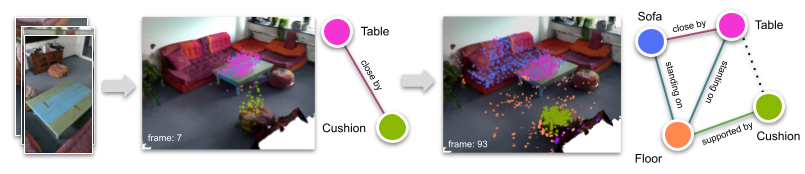

# 3D Semantic Scene Graph Estimations

This is a framework for developing 3D semantic scene graph estimations.
The repository includes five different methods, namely [IMP][IMP], [VGfM][VGfM], [3DSSG][3DSSG], [SGFN][SGFN] and [MonoSSG][MonoSSG]. 

<details>
  <summary>This repository has been used for the following publications:</summary>

* **Title**: [Incremental 3D Semantic Scene Graph Prediction from RGB Sequences][MonoSSG]
 **Authors**: [Shun-Cheng Wu][sc], [Keisuke Tateno][keisu], [Nassir Navab][nassir] and [Federico Tombari][fede]


* **Title**: [SceneGraphFusion: Incremental 3D Scene Graph Prediction from RGB-D Sequences][SGFN]
 **Authors**: [Shun-Cheng Wu][sc], [Johanna Wald][jojo], [Keisuke Tateno][keisu], [Nassir Navab][nassir] and [Federico Tombari][fede]


[sc]:http://campar.in.tum.de/Main/ShunChengWu
[keisu]:http://campar.in.tum.de/Main/KeisukeTateno
[jojo]:http://campar.in.tum.de/Main/JohannaWald
[nassir]:http://campar.in.tum.de/Main/NassirNavabCv
[fede]:http://campar.in.tum.de/Main/FedericoTombari

</details>

# Setup
## Environment.
```
# if you don't have miniconda
source setup_conda.sh 

# setup
source setup.sh

mkdir data
ln -s /path/to/your/3RScan ./data/

source Init.sh # This will set PYTHONPATH and activate the environment for you.
```
# Preparation
Download data
```
cd files
bash preparation.sh
```


## Prepare 3RScan dataset
Please make sure you agree the [3RScan Terms of Use](https://forms.gle/NvL5dvB4tSFrHfQH6) first, and get the download script and put it right at the 3RScan main directory.

Then run
```
python scripts/RUN_prepare_dataset_3RScan.py --download --thread 8
```

## Generate Experiment data
```
# For GT
# This script downloads preprocessed data for GT data generation, and generate GT data.
python scripts/RUN_prepare_GT_setup_3RScan.py --thread 16

# For Dense
# This script downloads the inseg.ply files and unzip them to your 3rscan folder, and 
generates training data.
python scripts/RUN_prepare_Dense_setup_3RScan.py -c configs/dataset/config_base_3RScan_inseg_l20.yaml --thread 16

# For Sparse
# This script downloads the 2dssg_orbslam3.[json,ply] files and unzip them to your 3rscan folder, and 
generates training data.
python scripts/RUN_prepare_Sparse_setup_3RScan.py -c configs/dataset/config_base_3RScan_orbslam_l20.yaml --thread 16
```

# Train 
The first time you may need want to chagne the wandb account in `configs/config_default.yaml`. Change the `wanb.entity` and `wanb.project` to yours. Or you can disable logging by passing `--dry_run`.
```
source Init.sh

# Train and eval everything. 
python scripts/RUN_traineval_all.py

# Train single
python main.py --mode train --config /path/to/your/config/file

# Eval one
python main.py --mode eval --config /path/to/your/config/file
```

# Trained models
We provide trained model using the optimized code (this one), instead of the one reported in our CVPR23 paper. Although the numbers are different but all methods follow the same trend. We encourage people compare to the results obtained by yourself using this repo.

Download the trained models and unzip them under `experiments` folder (you may need to create one by yourself). 

Note that the implementation of [SceneGraphFusion][SGFN] and [3DSSG][3DSSG] are different from the original papers. We tried to make all methods shared the same model settings in order to compare them fairly. 

<details>
  <summary>Results</summary>

The first **Trip. Obj. Pred.** are the result including all the predictions. The second **Trip.*, Obj.*, Pred.*** without considering `None` relationship.

With the same setup as the Table 1. 3RSca dataset with 20 objects and 8 predicate classes.
| Name  | Input  | Trip.    | Obj.     | Pred.    | Trip.*   | Obj.*    | Pred.*   | mR.Obj.  | mR. Pred. |
| ----- | ------ | -------- | -------- | -------- | -------- | -------- | -------- | -------- | --------- |
| IMP   | GT     | 45.3     | 65.4     | 94.0     | 44.3     | 66.0     | 56.6     | 56.2     | 41.8      |
| VGfM  | GT     | 52.9     | 70.8     | 95.0     | 51.5     | 71.4     | 62.8     | 59.5     | 46.8      |
| 3DSSG | GT     | 31.8     | 55.1     | 95.4     | 39.7     | 55.6     | 71.0     | 47.7     | 61.5      |
| SGFN  | GT     | 42.7     | 63.6     | 94.3     | 47.6     | 64.4     | 69.0     | 53.6     | 63.1      |
| Ours  | GT     | **63.9** | **79.4** | **95.6** | **63.4** | **80.0** | **76.0** | **78.2** | **64.8**  |
|       |        |          |          |          |          |          |          |          |           |
| IMP   | DENSE  | 24.6     | 47.7     | 89.2     | 19.7     | 49.5     | 20.9     | 34.7     | 23.9      |
| VGfM  | DENSE  | 25.9     | 48.4     | **90.4** | 19.6     | 50.0     | 20.4     | 34.8     | 21.5      |
| 3DSSG | DENSE  | 14.5     | 37.0     | 88.0     | 12.9     | 37.4     | 22.0     | 26.2     | 23.7      |
| SGFN  | DENSE  | 27.7     | 49.7     | 89.9     | 22.0     | 51.6     | 27.5     | 37.7     | 32.6      |
| Ours  | DENSE  | **29.5** | **52.0** | 88.6     | **23.3** | **53.8** | **28.4** | **43.8** | **35.8**  |
|       |        |          |          |          |          |          |          |          |           |
| IMP   | SPARSE | 8.6      | 27.7     | **90.9** | 3.6      | 24.5     | 4.0      | 20.2     | 14.7      |
| VGfM  | SPARSE | 9.0      | 28.0     | 90.7     | 4.0      | 28.8     | 4.4      | 24.3     | 13.9      |
| 3DSSG | SPARSE | 1.3      | 11.1     | 90.2     | 1.0      | 11.7     | 4.6      | 6.1      | 13.9      |
| SGFN  | SPARSE | 2.5      | 15.4     | 88.3     | 3.4      | 15.9     | 7.0      | 8.9      | 14.5      |
| Ours  | SPARSE | **9.9**  | **28.7** | 89.8     | **6.8**  | **29.5** | **8.2**  | **27.0** | **17.6**  |

With the same setup as the Table 2. 3RSca dataset with 160 objects and 26 predicate classes.
| Name  | Input | Trip. | Obj. | Pred. | Trip.* | Obj.* | Pred.* | mRe.Obj. | mRe.Pred. |
| ----- | ----- | ----- | ---- | ----- | ------ | ----- | ------ | -------- | --------- |
| IMP   | GT    | 64.2  | 43.0 | 16.2  | 4.9    | 42.9  | 16.4   | 16.0     | 3.6       |
| VGfM  | GT    | 64.5  | 46.0 | 17.4  | 5.9    | 46.0  | 17.6   | 19.1     | 5.5       |
| 3DSSG | GT    | 64.8  | 28.0 | 67.1  | 6.9    | 27.9  | 67.1   | 12.1     | 20.9      |
| SGFN  | GT    | 64.7  | 36.9 | 48.4  | 6.6    | 36.8  | 48.4   | 16.2     | 14.4      |
| Ours  | GT    | 67.6  | 53.4 | 48.1  | 14.8   | 53.2  | 48.1   | 28.9     | 24.7      |

</details>

| Input Type \ Mehtod | IMP        | VGfM       | 3DSSG      | SGFN       | Ours       |
| ------------------- | ---------- | ---------- | ---------- | ---------- | ---------- |
| GT                  | [Link][1]  | [Link][2]  | [Link][3]  | [Link][4]  | [Link][5]  |
| DENSE               | [Link][6]  | [Link][7]  | [Link][8]  | [Link][9]  | [Link][10] |
| SPARSE              | [Link][11] | [Link][12] | [Link][13] | [Link][14] | [Link][15] |
| GT [160/26]         | [Link][16] | [Link][17] | [Link][18] | [Link][19] | [Link][20] |


[1]:  https://www.campar.in.tum.de/public_datasets/2023_cvpr_wusc/trained_models/IMP_full_l20.zip
[2]: https://www.campar.in.tum.de/public_datasets/2023_cvpr_wusc/trained_models/VGfM_full_l20.zip
[3]: https://www.campar.in.tum.de/public_datasets/2023_cvpr_wusc/trained_models/3DSSG_full_l20.zip
[4]: https://www.campar.in.tum.de/public_datasets/2023_cvpr_wusc/trained_models/SGFN_full_l20.zip
[5]: https://www.campar.in.tum.de/public_datasets/2023_cvpr_wusc/trained_models/JointSSG_full_l20.zip
[6]: https://www.campar.in.tum.de/public_datasets/2023_cvpr_wusc/trained_models/IMP_inseg_l20.zip
[7]: https://www.campar.in.tum.de/public_datasets/2023_cvpr_wusc/trained_models/VGfM_inseg_l20.zip
[8]: https://www.campar.in.tum.de/public_datasets/2023_cvpr_wusc/trained_models/3DSSG_inseg_l20.zip
[9]: https://www.campar.in.tum.de/public_datasets/2023_cvpr_wusc/trained_models/SGFN_inseg_l20.zip
[10]: https://www.campar.in.tum.de/public_datasets/2023_cvpr_wusc/trained_models/JointSSG_inseg_l20.zip
[11]: https://www.campar.in.tum.de/public_datasets/2023_cvpr_wusc/trained_models/IMP_orbslam_l20.zip
[12]: https://www.campar.in.tum.de/public_datasets/2023_cvpr_wusc/trained_models/VGfM_orbslam_l20.zip
[13]: https://www.campar.in.tum.de/public_datasets/2023_cvpr_wusc/trained_models/3DSSG_orbslam_l20.zip
[14]: https://www.campar.in.tum.de/public_datasets/2023_cvpr_wusc/trained_models/SGFN_orbslam_l20.zip
[15]: https://www.campar.in.tum.de/public_datasets/2023_cvpr_wusc/trained_models/JointSSG_orbslam_l20.zip
[16]: https://www.campar.in.tum.de/public_datasets/2023_cvpr_wusc/trained_models/IMP_full_l160.zip
[17]: https://www.campar.in.tum.de/public_datasets/2023_cvpr_wusc/trained_models/VGfM_full_l160.zip
[18]: https://www.campar.in.tum.de/public_datasets/2023_cvpr_wusc/trained_models/3DSSG_full_l160.zip
[19]: https://www.campar.in.tum.de/public_datasets/2023_cvpr_wusc/trained_models/SGFN_full_l160.zip
[20]: https://www.campar.in.tum.de/public_datasets/2023_cvpr_wusc/trained_models/JointSSG_full_l160.zip

# License
<a rel="license" href="http://creativecommons.org/licenses/by-nc-sa/4.0/"></a><br />This work is licensed under a <a rel="license" href="http://creativecommons.org/licenses/by-nc-sa/4.0/">Creative Commons Attribution-NonCommercial-ShareAlike 4.0 International License</a>.

# Citations
If you find the code useful please consider citing our papers:

```
@inproceedings{wu2023incremental,
  title={Incremental 3D Semantic Scene Graph Prediction from RGB Sequences},
  author={Wu, Shun-Cheng and Tateno, Keisuke and Navab, Nassir and Tombari, Federico},
  booktitle={Proceedings of the IEEE/CVF Conference on Computer Vision and Pattern Recognition},
  pages={5064--5074},
  year={2023},
}

@inproceedings{wu2021scenegraphfusion,
  title={Scenegraphfusion: Incremental 3d scene graph prediction from rgb-d sequences},
  author={Wu, Shun-Cheng and Wald, Johanna and Tateno, Keisuke and Navab, Nassir and Tombari, Federico},
  booktitle={Proceedings of the IEEE/CVF Conference on Computer Vision and Pattern Recognition},
  pages={7515--7525},
  year={2021}
}

@inproceedings{Wald2020,
    title = {{Learning 3D Semantic Scene Graphs from 3D Indoor Reconstructions}},
    author = {Wald, Johanna and Dhamo, Helisa and Navab, Nassir and Tombari, Federico},
    booktitle = {Proceedings IEEE Conference on Computer Vision and Pattern Recognition (CVPR)},
    year = {2020}
}
```
[IMP]: https://openaccess.thecvf.com/content_cvpr_2017/papers/Xu_Scene_Graph_Generation_CVPR_2017_paper.pdf
[VGfM]: https://arxiv.org/abs/1807.05933
[MonoSSG]: https://openaccess.thecvf.com/content/CVPR2023/papers/Wu_Incremental_3D_Semantic_Scene_Graph_Prediction_From_RGB_Sequences_CVPR_2023_paper.pdf
[SGFN]: https://openaccess.thecvf.com/content/CVPR2021/papers/Wu_SceneGraphFusion_Incremental_3D_Scene_Graph_Prediction_From_RGB-D_Sequences_CVPR_2021_paper.pdf
[3DSSG]: https://openaccess.thecvf.com/content_CVPR_2020/papers/Wald_Learning_3D_Semantic_Scene_Graphs_From_3D_Indoor_Reconstructions_CVPR_2020_paper.pdf
